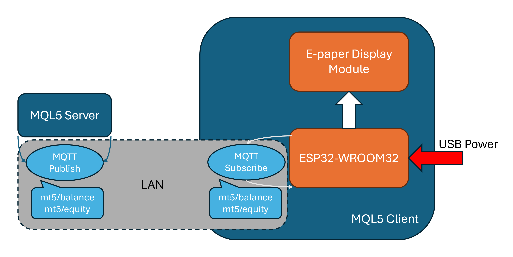

# MQL Dashboard using EPaper Display and ESP32

## Project Summary

A Metatrader 5 server is hosted on a PC, which broadcasts MQTT data. This data is received by an ESP32 microcontroller board via WiFi and sent to an E-Paper display driver which displays the received data into a readable format, like a trading profile dashboard.

## Architecture



## Hardware

### Requirements
- ESP32-WROOM32 Development Board
- Waveshare 4.2inch EPaper Display Module (Rev2.1)
- 8 Jumper cables
- 3D Printed Display Case

### Schematics


## Software

### Server Setup
The server must be able to run the Metatrader 5 terminal. Currently, Linux, Windows and MacOS are supported: https://www.metatrader5.com/en/download

Make sure `python` and `pip` are installed and available on the server's command-line.

```sh
pip install paho-mqtt Metatrader5
python mt5server.py
```
You may choose to run this script in the background or as a service.

### Client Setup

1. Open `mt5client.ino` in the Arduino IDE.
2. Update the WiFi SSID, password and the MQTT server IP address in the above file.
3. Connect and select your ESP32 board in the Arduino IDE.
4. `Upload` the `mt5client.ino` sketch to your board.
5. The ESP32 board should now be connected to your configured WiFi from step 2 and soon update the display.

## Showcase


## Future Improvements
1. Better case lid that remains flush.
2. Better access to the board's reset button.
3. Use of battery-operated power instead of external USB.
4. Display open trade positions as a dynamic list.

## Technical References

### Microcontroller Board

`ESP32-WROOM32 DevKit` is an integrated development board with easy pinouts for interfacing with common components. This project utilizes the SPI interface on `ESP32-WROOM32 development kit` to drive the SPI-based E-Ink display module. The development board also connects to the WiFi to receive the MQTT broadcast messages from the MQTT server.

https://docs.espressif.com/projects/esp-dev-kits/en/latest/esp32/esp32-devkitc/user_guide.html#esp32-devkitc-v4

### EPaper Display

`Waveshare 400x300, 4.2inch E-Ink display module, three-color` was used for this project. An E-Paper display was chosen because of its low-power consumption and a portable display solution.

https://www.waveshare.com/product/displays/e-paper/epaper-2/4.2inch-e-paper-module-b.htm

#### Specifications

- Operating voltage: 3.3V~5V
- Interface: 3-wire SPI, 4-wire SPI
- Outline dimension: 103.0mm × 78.5mm
- Display size: 84.8mm × 63.6mm
- Dot pitch: 0.212 × 0.212
- Resolution: 400 × 300
- Display color: red, black, white
- Grey level: 2
- Full refresh time: 15s
- Refresh power: 26.4mW(typ.)
- Standby power: <0.017mW
- Viewing angle: >170°

### Metatrader 5 Python Package
Python integration to use Metatrader 5 functionality in python programs.

https://pypi.org/project/MetaTrader5/ <br>
https://www.mql5.com/en/docs/python_metatrader5

### MQTT
MQTT is an OASIS standard messaging protocol for the Internet of Things (IoT). It is designed as an extremely lightweight publish/subscribe messaging transport that is ideal for connecting remote devices with a small code footprint and minimal network bandwidth.

https://mqtt.org/

### Arduino Display Library for SPI E-Paper Displays
A C library that enables and simplifies working with E-Paper displays using Adafruit_GFX, an Arduino graphics library as the base. It is designed specifically for displays that use SPI interface.

https://github.com/ZinggJM/GxEPD2
